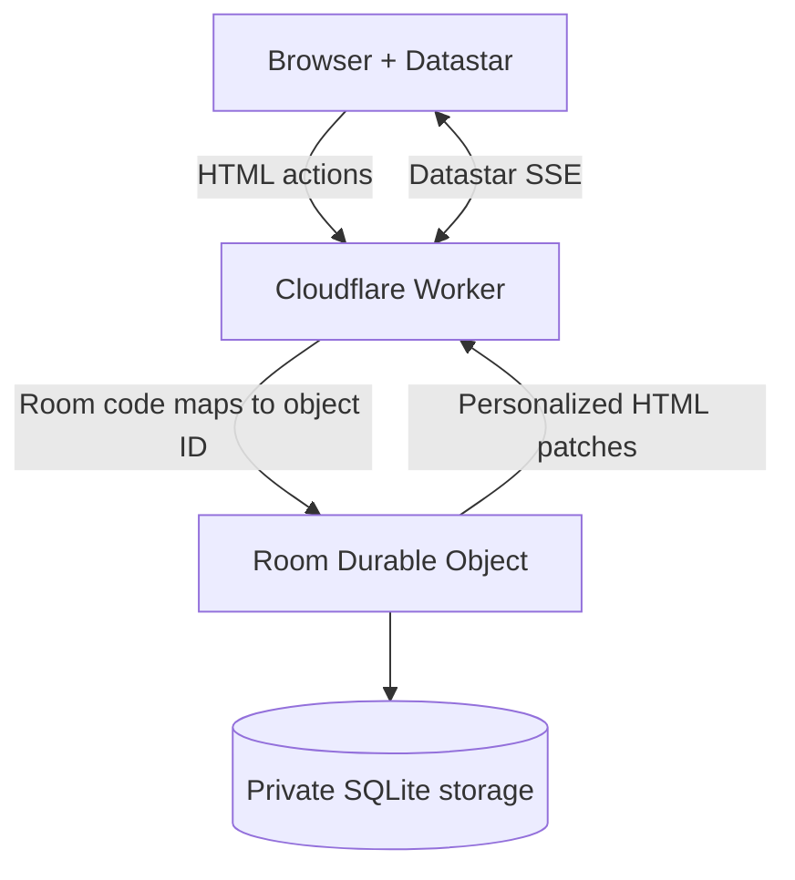

# Pocket Plan

A small, real-time planning poker site built with [Datastar](https://data-star.dev/) and [Cloudflare Workers](https://developers.cloudflare.com/workers/). Each room maps to one SQLite-backed [Cloudflare Durable Object](https://developers.cloudflare.com/durable-objects/), giving its participants a single strongly consistent source of truth.

**Live site:** [poker.codefutures.uk](https://poker.codefutures.uk/)

## Features

- No user signups: a random, HTTP-only cookie identifies an anonymous browser session.
- One-step room creation that immediately joins the creator.
- Shareable eight-character room links and room-code joining.
- Up to 20 participants per room, enforced inside the Durable Object.
- Hidden planning-poker votes, reveal, distribution, numeric average, consensus, and repeat rounds.
- Real-time, participant-specific DOM updates over Datastar server-sent events.
- Room, participant, round, and vote state in Durable Object SQLite storage while the room is active.
- Server-rendered HTML and a self-hosted Datastar client of roughly 33 KiB (13 KiB gzip); no SPA or frontend build pipeline.
- Responsive, accessible interface with no external fonts, analytics, or runtime application dependencies.

## Architecture



The top-level Worker creates anonymous sessions and routes `/r/:code/*` requests. A `PlanningRoom` Durable Object serializes all room actions, stores state in its embedded SQLite database, enforces capacity, and broadcasts HTML patches to open Datastar streams.

Disconnected participants remain reserved for two minutes to tolerate refreshes and temporary network loss. Explicitly leaving releases a place immediately; when the final participant leaves, all room storage is deleted. Otherwise, participant activity extends the room lifetime and an alarm deletes the room after one idle day. Room codes are unlisted capability links, not authentication boundaries.

## Security and limits

- HTML output is escaped and protected by a nonce-based Content Security Policy and additional browser security headers.
- Cross-origin mutations are rejected, and request bodies are streamed with a 4 KiB maximum.
- Participant names are limited to 40 characters, room names to 60 characters, and votes to the fixed deck shown in the interface.
- Rate-limited room actions—including joins, votes, reveals, new rounds, and SSE subscriptions—are capped at 10 per participant and 40 per room in each 10-second window.
- Each participant may open up to two SSE connections. Slow consumers are disconnected rather than allowed to accumulate unbounded queued updates.

These controls are scoped to individual rooms. They do not globally limit creation of new rooms, so a public deployment expecting abuse should add a [Cloudflare rate-limiting rule](https://developers.cloudflare.com/waf/rate-limiting-rules/) for `POST /rooms`.

## Local development

Requirements: Node.js 20 or later and npm. CI currently uses Node.js 24.

```sh
npm install
npm run dev
```

Wrangler prints the local URL (normally `http://localhost:8787`). No environment variables or external services are required.

## Validation

```sh
npm run check
```

This runs strict TypeScript checking and integration tests in the Cloudflare Workers runtime. The tests cover static delivery, room creation, anonymous cookie sessions, Durable Object persistence, voting/reveal/reset, personalized SSE updates and connection limits, output escaping and CSP, cross-origin and oversized requests, input limits, mutation rate limiting, idle-expiry scheduling, eight-character room codes, and the 20-person limit.

GitHub Actions runs type-checking, tests, and a Wrangler deployment dry-run for pushes to `main`, pull requests, and manual dispatches. The workflow validates the application but does not deploy it.

## Deploy

Authenticate [Wrangler](https://developers.cloudflare.com/workers/wrangler/) once, then deploy the Worker and its Durable Object migration:

```sh
npx wrangler login
npm run deploy
```

The first deploy creates the `PlanningRoom` SQLite-backed Durable Object namespace declared in `wrangler.jsonc`. No secrets are needed. The configuration explicitly enables the `workers.dev` route, deployment preview URLs, and Workers observability.

## Datastar

Datastar `v1.0.3` is pinned and self-hosted at `public/datastar-1.0.3.js` to avoid a production CDN dependency. The checked-in client is roughly 33 KiB (13 KiB gzip), and its MIT license is included in `public/THIRD_PARTY_LICENSES.txt`.
