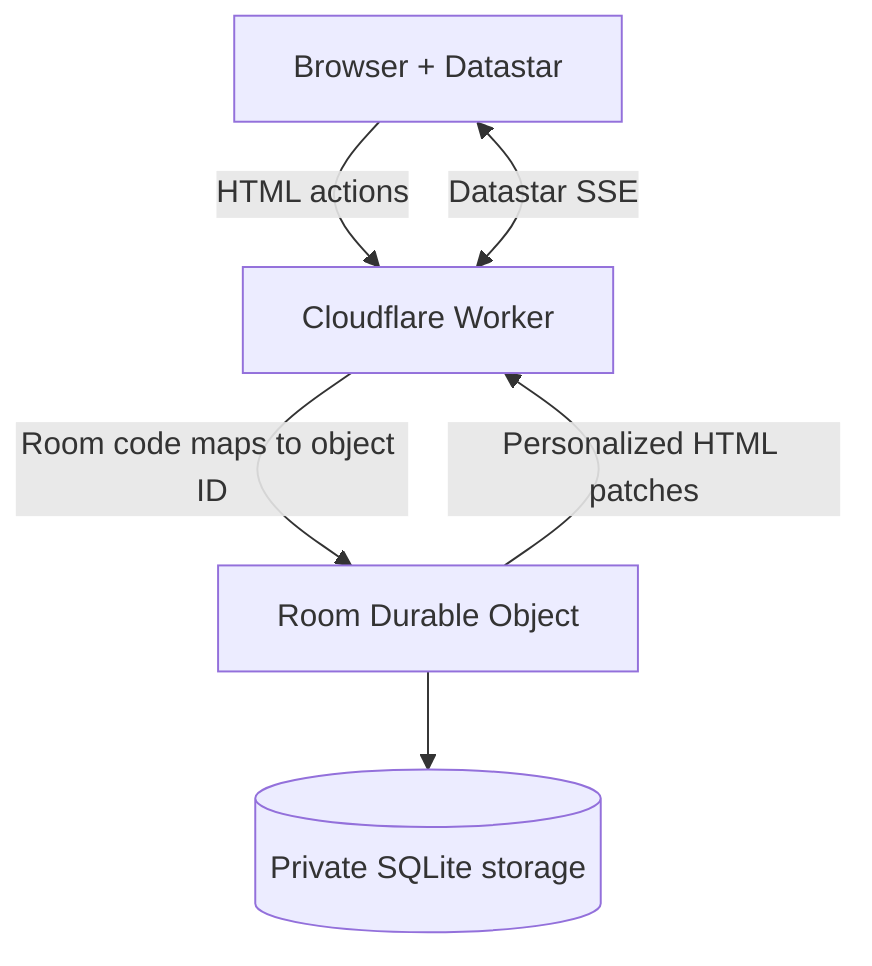

# Pocket Plan

A small, real-time planning poker site built with [Datastar](https://data-star.dev/) and Cloudflare Workers. Each room maps to one SQLite-backed Cloudflare Durable Object, giving its participants a single strongly consistent source of truth.

## Features

- No user signups: a random, HTTP-only cookie identifies an anonymous browser session.
- One-step room creation that immediately joins the creator.
- Shareable six-character room links and room-code joining.
- Up to 20 participants per room, enforced inside the Durable Object.
- Hidden planning-poker votes, reveal, distribution, numeric average, consensus, and repeat rounds.
- Real-time, participant-specific DOM updates over Datastar server-sent events.
- Persistent room, participant, round, and vote state in Durable Object SQLite storage.
- Server-rendered HTML and a self-hosted 11–12 KiB Datastar client; no SPA or frontend build pipeline.
- Responsive, accessible interface with no external fonts, analytics, or runtime application dependencies.

## Architecture



The top-level Worker creates anonymous sessions and routes `/r/:code/*` requests. A `PlanningRoom` Durable Object serializes all room actions, stores state in its embedded SQLite database, enforces capacity, and broadcasts HTML patches to open Datastar streams.

Disconnected participants remain reserved for two minutes to tolerate refreshes and temporary network loss. Explicitly leaving releases a place immediately. Room codes are unlisted capability links, not authentication boundaries.

## Local development

Requirements: Node.js 20+ and npm.

```sh
npm install
npm run dev
```

Wrangler prints the local URL (normally `http://localhost:8787`). No environment variables or external services are required.

## Validation

```sh
npm run check
```

This runs strict TypeScript checking and integration tests in the Cloudflare Workers runtime. The tests cover static delivery, room creation, anonymous cookie sessions, Durable Object persistence, voting/reveal/reset, output escaping, and the 20-person limit.

## Deploy

Authenticate Wrangler once, then deploy the Worker and its Durable Object migration:

```sh
npx wrangler login
npm run deploy
```

The first deploy creates the `PlanningRoom` SQLite-backed Durable Object namespace declared in `wrangler.jsonc`. No secrets are needed.

## Datastar

Datastar `v1.0.3` is pinned and self-hosted at `public/datastar-1.0.3.js` to avoid a production CDN dependency. Its MIT license is included in `public/THIRD_PARTY_LICENSES.txt`.
